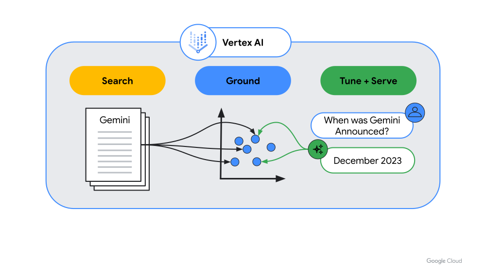
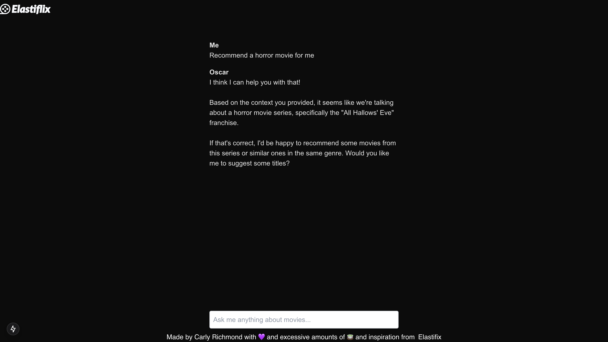

# Lab 6: RAG Integration

We're almost there attendees! In this segment we'll build on what we learned about Langchain in [lab 2](./2-vector-embeddings.md) to provide our documents as a context to the LLM to ground the responses.

## What is Grounding?

Grounding is the process of providing additional data that the LLM has not been trained on to ensure responses contain correct and domain-specific information, commonly using vector search:



As you may have guessed from your personal use of LLMs, when faced with a question they don't have information for, they may hallucinate and generate incorrect responses. In many context, such as financial or other heavily regulated domains, this may open us to providing incorrect advise in breach of regulation or expose the company to reputational risks (think [DHL](https://www.theguardian.com/technology/2024/jan/20/dpd-ai-chatbot-swears-calls-itself-useless-and-criticises-firm)).

In this segment, we shall use Langchain and the Langchain adapter for AI SDK by Vercel to provide the context to our LLM.

## Steps

1. Ensure the following dependencies are installed in your Next.js application:

```zsh
npm i @langchain/community @elastic/elasticsearch @langchain/ollama @langchain/core
```

2. Create a new utility `lib/movie-finder.ts`, and initialize the Ollama embeddings using the Langchain wrapper to embed the user query:

```tsx
import { Ollama, OllamaEmbeddings } from "@langchain/ollama";

// Initialize Ollama embeddings for the query
const ollamaEmbeddings = new OllamaEmbeddings({
  model: "mxbai-embed-large", // Default value
  //baseUrl: "http://localhost:11434", // Default value
});
```

3. Create the Elasticsearch vector store using Langchain and the Elasticsearch JavaScript client:

```tsx
import {
  ElasticVectorSearch,
  type ElasticClientArgs,
} from "@langchain/community/vectorstores/elasticsearch";

import { Client, type ClientOptions } from "@elastic/elasticsearch";


// Initialize Langchain and Elasticsearch
const config: ClientOptions = {
  node: process.env.ELASTIC_DEPLOYMENT,
};

if (process.env.ELASTIC_API_KEY) {
  config.auth = {
    apiKey: process.env.ELASTIC_API_KEY,
  };
}

const clientArgs: ElasticClientArgs = {
  client: new Client(config),
  indexName: process.env.INDEX_NAME,
  vectorSearchOptions: {
    engine: "hnsw",
    similarity: "cosine", //Default cosine
  },
};
```

4. Create the LLM prompt and initialize the Llama 3 model:

```tsx
import { ChatPromptTemplate } from "@langchain/core/prompts";

// Initialise LLM and prompt
const template = `You are a helpful movie trivial assistant that loves to recommend movies to people. 
      Check your knowledge base before answering any questions.
      If no relevant information is found in the tool calls, respond, "I don't know, sorry!"
      
      Please use the below context in your answer:
      <context>
      {context}
      </context>`;

const prompt = ChatPromptTemplate.fromTemplate(template);

const llm = new Ollama({
  model: "llama3", // Default: "llama3",
  temperature: 0,
  maxRetries: 3,
});
```

5. Create a new utility function `recommendMovies` that filters out adult content and streams the response from the LLM using a retriever and document chain:

```tsx
import { createStuffDocumentsChain } from "langchain/chains/combine_documents";
import { StringOutputParser } from "@langchain/core/output_parsers";

/**
 * Example search function to find relevant movies
 * @param text: prompt to be used for similarity search
 * @returns
 */
export async function recommendMovies(question: string): Promise<ReadableStream> {
  const filter = [
    {
      operator: "match",
      field: "isAdult",
      value: false,
    },
  ];
  const retriever = vectorStore.asRetriever(3, filter);

  const customRagChain = await createStuffDocumentsChain({
    llm: llm,
    prompt: prompt,
    outputParser: new StringOutputParser(),
  });

  const context = await retriever.invoke(question);

  const stream = await customRagChain.stream({
    question: question,
    context,
  });

  return stream;
}
```

6. Amend the [`/api/chat`](../movie-rag/src/app/api/chat/route.ts) route to use the `recommendMovies` function. Note this requires using the [Langchain adapter](https://sdk.vercel.ai/providers/adapters/langchain) to translate the Langchain stream to an AI SDK UI stream:

```tsx
import { LangChainAdapter } from 'ai';
import { recommendMovies } from "../../lib/movie-finder";

// Allow streaming responses up to 30 seconds
export const maxDuration = 30;

export async function POST(req: Request) {
  const { messages } = await req.json();
  const errorMessage = "I don't know what you're talking about, HAL.";

  if (messages.length === 0) {
    return {
      message: errorMessage,
    }
  }

  try {
    const question: string = messages[messages.length - 1].content;
    const stream = await recommendMovies(question);
    
    return LangChainAdapter.toDataStreamResponse(stream);
  } catch (e) {
    console.error(e);
    return {
      message: errorMessage,
    };
  }
}
```

## Expected Result

When running the application locally using `npm run dev` we are able to ask Oscar questions and receive a response based on the provided context:

